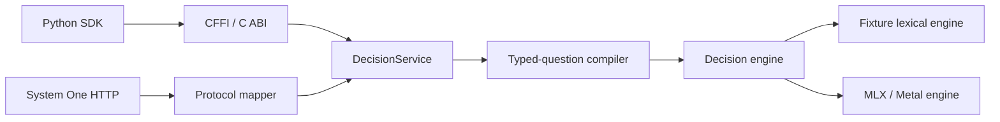

# decengine

`decengine` is a **local, typed semantic-decision runtime**. Given JSON state and
narrow questions, it produces typed `Choice`, binary `Noul`, and ordinal `Score`
results with distributions, confidence, and cache statistics. It has three supported
integration surfaces:

- a Rust runtime and `decengine` CLI;
- a stable C ABI (`include/decengine.h`) and pure-Python CFFI SDK; and
- a System One-compatible HTTP API bound to `127.0.0.1` by default.

It deliberately separates two modes:

| Mode | Where it runs | Purpose | Model quality claim? |
| --- | --- | --- | --- |
| `fixture` | Any development platform | Deterministic lexical backend for tests, demos, and client integration | **No** |
| `mlx` | macOS on Apple Silicon | Local MLX/Metal inference over an installed allowlisted checkpoint | Only after the applicable hardware/release gates |

The fixture engine never downloads models and is not an embedding model. Do not use
its outputs or its UAT success as model-performance evidence.

## Install and run

### 1. Replicate the development environment

Requirements: Rust **1.88** (pinned in `rust-toolchain.toml`), Python **3.10+**, and a
C compiler. The commands below avoid accidentally using an older system `python3`.

```bash
git clone <repository-url>
cd decengine

python3.10 -m venv .venv       # use any Python >=3.10
. .venv/bin/activate
python -m pip install --upgrade pip
python -m pip install -e '.[dev]'

make test                       # Rust workspace + Python SDK tests
make uat                        # native CFFI and localhost HTTP acceptance tests
```

`make test` runs the fixture backend; it is the portable, offline replication path.
The CI equivalents also enforce formatting, Clippy, mypy, Ruff, source boundaries,
and a 90% Python coverage floor. If `python3` on your `PATH` is older than 3.10,
activate the environment above (or run `PATH="$PWD/.venv/bin:$PATH" make test`).

### 2. Start a no-model local service (development only)

```bash
cargo run --locked -p decengine-cli --features fixture-engine -- \
  serve --engine fixture --host 127.0.0.1 --port 8787
```

In another terminal:

```bash
curl http://127.0.0.1:8787/healthz
curl -H 'content-type: application/json' \
  --data @tests/protocol/fixtures/systemone-request.json \
  http://127.0.0.1:8787/v1/systemone
```

The API exposes `GET /healthz`, `GET /v1/models`, and `POST /v1/systemone`. The request
fixture above demonstrates all three question types. The server refuses a non-loopback
bind unless `--allow-non-loopback` is supplied explicitly.

### 3. Install and serve a real local model (production path)

This path requires **macOS/arm64**. MLX is not a Linux or Intel Mac backend. Build
without the fixture feature, choose a writable model store, install one allowlisted
checkpoint, and serve it:

```bash
cargo build --locked --release -p decengine-cli --no-default-features --features mlx
export DECENGINE_HOME="$HOME/.decengine"
BIN=target/release/decengine

"$BIN" pull Qwen/Qwen3-Embedding-0.6B       # downloads from Hugging Face
# Or install an already-downloaded checkpoint:
# "$BIN" pull Qwen/Qwen3-Embedding-0.6B --from /path/to/checkpoint

"$BIN" list
"$BIN" serve --engine mlx --model Qwen/Qwen3-Embedding-0.6B --port 8787
```

The only bundled, allowlisted production identities are:

- `Qwen/Qwen3-Embedding-0.6B` (profile v1)
- `microsoft/harrier-oss-v1-0.6b` (profile v2)

Installation copies files into `$DECENGINE_HOME/models/`, writes `install.json` with
file hashes, and verifies those hashes before MLX loads a checkpoint. `pull` is the
only normal runtime operation that needs network access; inference has no remote
fallback. Validate both models offline before release work:

```bash
export DECENGINE_QWEN_DIR=/path/to/qwen-checkpoint
export DECENGINE_HARRIER_DIR=/path/to/harrier-checkpoint
bash tests/hardware/run.sh
```

### Python SDK / C ABI

The Python wheel is intentionally a CFFI client; it does **not** compile or bundle the
native library. Build the MLX library and point the SDK at it:

```bash
cargo build --locked --release -p decengine-ffi --no-default-features --features mlx
export DECENGINE_LIB_PATH="$PWD/target/release/libdecengine.dylib"
```

```python
from decengine import Choice, Engine, Noul, Score

with Engine(
    "Qwen/Qwen3-Embedding-0.6B",
    options={"engine": "mlx", "model_store": "/Users/me/.decengine"},
) as engine:
    response = engine.decide(
        state={"subject": "Refund charged twice", "body": "Please help today"},
        questions={
            "route": Choice("Which team should handle this?", {
                "billing": "payments, charges, invoices, and refunds",
                "technical": "bugs, outages, and integrations",
            }),
            "urgent": Noul("Does this require attention today?"),
            "severity": Score("How severe is this?", [
                "minor inconvenience", "work is blocked", "critical business impact",
            ]),
        },
    )
```

For fixture-only SDK development, build `decengine-ffi` with its default features and
pass `options={"engine": "fixture"}`. ABI version 1 functions and status codes are in
[`include/decengine.h`](include/decengine.h).

## How the runtime is organized



- `crates/decengine-core`: public request/result types, validation, and errors.
- `crates/decengine-compiler`: converts `choice`, `noul`, and `score` questions into
  model queries/candidates and cache keys.
- `crates/decengine-engine`: engine boundary plus the deterministic fixture engine.
- `crates/decengine-engine-mlx`: Apple Silicon MLX implementation; tensors stay behind
  the engine boundary.
- `crates/decengine-models`: embedded profiles, allowlist, model-store installation,
  and integrity verification.
- `crates/decengine-runtime`, `-protocol`, `-server`, `-ffi`, `-cli`: shared service,
  HTTP mapping, loopback server, C ABI, and operational CLI.
- `python/decengine`: typed CFFI client; `tests/` covers native, Python, protocol, UAT,
  and Apple hardware gates.

`Choice` returns the selected option and its distribution; `Noul` returns the
probability of the semantic `supported` outcome; `Score` returns both a selected
distribution and its probability-weighted numeric value. Confidence is normalized
distribution entropy, **not** a calibrated probability of correctness.

## Experiments and retained evidence

`results/` is an experiment archive, not a set of shipped model configurations. Most
experiments preserve fixtures, raw predictions, manifests, hashes, timing, and frozen
selection records. Absolute paths in historical artifact metadata identify the original
local caches; use the scripts and current paths when re-running them.

| Area | What was tested | Main recorded outcome | Entry point / evidence |
| --- | --- | --- | --- |
| Qwen prompt variants | 100-case synthetic decision fixture, followed by a locked 60-case holdout | Best locked task-instruction variant: 96/180 (53.3%) vs baseline 88/180 (48.9%); urgency remained 100% sensitive and 0% specific, so it was **not promoted**. | [`QWEN_PROMPT_EXPERIMENT.md`](results/QWEN_PROMPT_EXPERIMENT.md), [`QWEN_DEVELOPMENT_SWEEP.md`](results/QWEN_DEVELOPMENT_SWEEP.md), [`QWEN_HOLDOUT_EVALUATION.md`](results/QWEN_HOLDOUT_EVALUATION.md) |
| Qwen / Harrier / JEV comparison | Same 100-case decision contract, with archived JEV judgments | Qwen prompt work is descriptive only; the external JEV comparison has credentialed live-run support and archived evidence. | [`README-comparison.md`](results/README-comparison.md), `results/compare_jev.py` |
| Fixed-task frozen probes | Separate 300-train / 90-test embeddings with train-only grouped CV | Test macro-F1 mean: Qwen .744, Harrier .765; state-only controls were stronger on this small fixture, a warning against causal claims about task queries. | [`results/probes/README.md`](results/probes/README.md) |
| Metal probe replay | Saved fixed-task probes run with embeddings and scoring resident on MLX/Metal | All 300 labels matched CPU artifacts; probe end-to-end p50 was about 79 ms/case for both checkpoints. | [`results/probes/metal/README.md`](results/probes/metal/README.md) |
| Varied single-question scorer | Generic pairwise scorer, clean 300-case LOQFO training and sealed 200-case test | Accuracy: Qwen .495, Harrier .465. Results support only this small fixture, not unseen-question generalization. | [`results/probes/varied/README.md`](results/probes/varied/README.md) |
| Matched multi-question scorer | Frozen train-only typed heads on 60 cases / 180 questions | Qwen: .333/.483/.350; Harrier: .367/.450/.367 (choice/noul/score). Both got all three right on 6/60 cases. | [`results/probes/varied/matched/RESULTS.md`](results/probes/varied/matched/RESULTS.md) |
| All-Metal varied scorer | Frozen generic typed scorer with GPU-resident pair construction and scoring | Exact selected-label parity against the archived NumPy scorer; repeated runs put case p50 near 296–298 ms. | [`results/probes/varied/metal/README.md`](results/probes/varied/metal/README.md) |
| Explicit-state condition | Label-informed clarity edits evaluated with frozen heads | It is an authored intervention, explicitly **not** an independent generalization test. | [`results/probes/varied/explicit/README.md`](results/probes/varied/explicit/README.md) |
| Prompt serialization study | Isolated train-only study of four textual serializations across both models | Generates real MLX exports and grouped CV only; it does not consume held-out fixtures. | [`results/probes/varied/prompt-study/README.md`](results/probes/varied/prompt-study/README.md) |
| LoRA fresh-60 | Frozen LoRA versus full-660 and same-460 frozen-head comparators | Both LoRAs scored 15/60 choice, 30/60 noul, 20/60 score, and 0/60 all-three; inference used an explicit 512-token extrapolation policy. | [`results/probes/varied/lora/README.md`](results/probes/varied/lora/README.md) |
| Laya baselines | Public Laya SDK, plus a separately pinned/parity-checked MLX port | Laya MLX 300-case run: 59.0% owner, 61.0% urgent, 41.0% impact; it is a comparison system, not a decengine backend. | [`results/laya/README.md`](results/laya/README.md), [`results/laya/mlx/README.md`](results/laya/mlx/README.md) |
| Domain protocol | Ten leave-one-industry-out development folds | Preserves `probe-test-300` as a sealed external set; never pool it into training or tuning. | [`results/probes/domain-generalization/README.md`](results/probes/domain-generalization/README.md) |

### Fixtures and reproducibility boundaries

- `benchmarks/cases/decision-cases-100.jsonl`: original 100-case Qwen/JEV comparison;
  `decision-cases-holdout.jsonl` is its separately authored 60-case locked holdout.
- `probe-train-300.jsonl` / `probe-test-300.jsonl` and the 90-case split support the
  fixed-task probe work. Keep test inputs out of fitting and selection.
- `benchmarks/cases/varied/` contains the varied single-question fixtures; `multi/`
  contains the 120-case training and several independent 60-case evaluation fixtures.
- Run only the script named by an experiment's README. Several studies require installed
  local MLX checkpoints or feature exports that are intentionally not checked in.
- The bundled manifests are release profiles. Experimental files, such as
  `models/profiles/qwen3-embedding-0.6b-direct-rubric.experimental.json`, are opt-in
  research artifacts and do not replace a shipped profile.

For a supported release, require the offline Apple hardware suite for **both**
checkpoints and publish the reviewed hardware report. Synthetic accuracy, calibration,
latency, or parity artifacts alone are not deployment-suitability claims.

## Privacy and safety

Inference does not fall back to a remote service, telemetry is absent, and HTTP binds
to loopback by default. `pull` may contact Hugging Face; all other supported inference
paths can operate from an installed local model store. The repository's fictional
benchmark references are evaluation annotations, not operational, legal, medical, or
safety advice.

## License

MIT. See [`LICENSE`](LICENSE).
