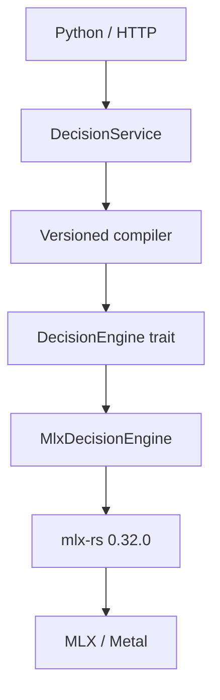

# decengine v1.0 — Technical Design

Status: frozen architecture, with implementation gates identified in
`IMPLEMENTATION_STATUS.md`.

## Dependency direction

Only `decengine-engine-mlx` may reference `mlx-rs`, MLX arrays, Metal, or GPU buffers.
The engine boundary is coarse: load, evaluate a compiled batch, unload. It never exposes
`embed`, cosine, softmax, hidden states, or device tensors to the rest of the workspace.

## Workspace

| Crate | Responsibility |
|---|---|
| `decengine-core` | Stable questions, results, errors, and validation |
| `decengine-engine` | Opaque engine contract and test-only fixture engine |
| `decengine-engine-mlx` | Apple MLX implementation; sole `mlx-rs` dependency |
| `decengine-models` | Profiles, allowlist, downloads, checksums, local store |
| `decengine-compiler` | Versioned query/candidate compilation and cache identity |
| `decengine-runtime` | Shared model-bound decision orchestration |
| `decengine-protocol` | Versioned localhost wire mapping |
| `decengine-ffi` | Panic-contained C ABI and ownership rules |
| `decengine-server` | Axum routes and HTTP error mapping |
| `decengine-cli` | `serve`, `pull`, `list`, and `rm` |

## Engine batch

Each decision contains a semantic kind, formatted query, candidates, optional ordinal
values, and a deterministic cache key. Cache identity includes model ID, profile and
compiler versions, question kind, prompt, candidates, and role templates. State is not in
the candidate key.

The target GPU pipeline is:

Normalized query `q` and candidate matrix `C` produce `s = qCᵀ`, logits `z = s/T`, and
`p = softmax(z)`. Choice uses `argmax(p)`, Noul returns `P(supported)`, and Score returns
`Σ valueᵢpᵢ`. Default confidence may use `1 - H(p)/log(k)`.

## Model profiles

Profiles absorb checkpoint packaging differences: architecture metadata, optional LM head,
tokenizer behavior, padding, query/candidate templates, pooling, normalization, limits,
and temperature. Public callers never configure those details.

Weights are upstream Hugging Face safetensors. `pull` is the only network-capable runtime
operation. Every installed file is hashed into `install.json` and verified before model
resolution.

## ABI

The ABI uses opaque handles, UTF-8 JSON requests/results, integer status codes, and explicit
allocation ownership. No Rust type crosses the boundary. Every entrypoint contains panics;
the caller releases response strings only with `de_string_free`. `de_last_error` is
thread-local and valid until the next ABI call on that thread.

The internal ABI JSON is versioned independently from the HTTP wire shape.

## Concurrency

`DecisionService` serializes engine access. This is a valid v1 behavior and makes GPU
ownership explicit. Future batching or multiple resident models can remain behind the same
public interfaces.

## Release invariants

- Product builds use `--no-default-features --features mlx`.
- The fixture backend is never present in release artifacts.
- Exact `mlx-rs` upgrades rerun both parity suites, decision regressions, performance,
  memory, CFFI, and HTTP acceptance tests.
- Hardware parity and offline inference are hard release gates.
